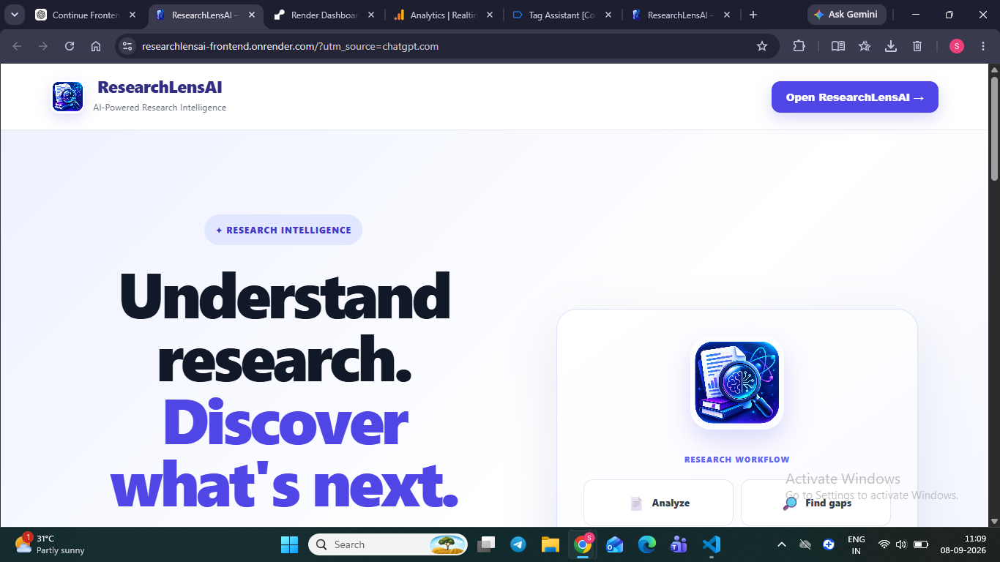
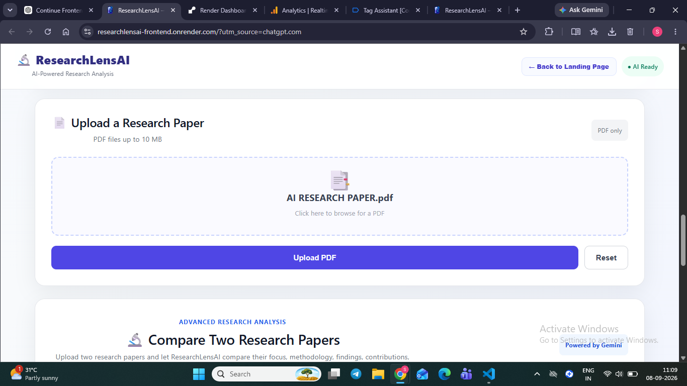
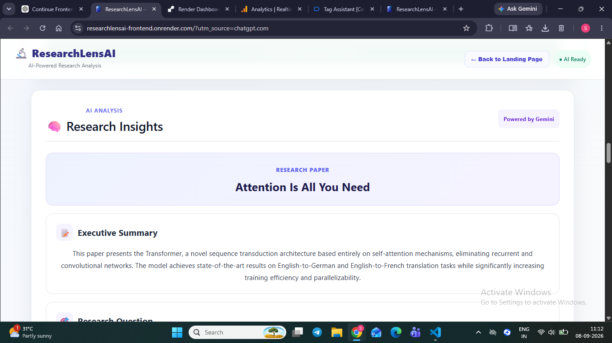
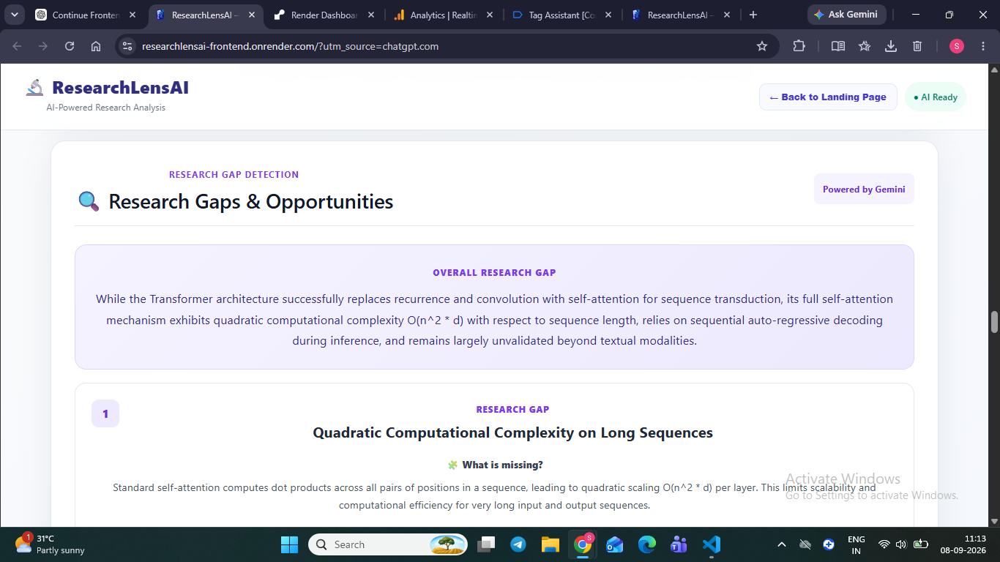
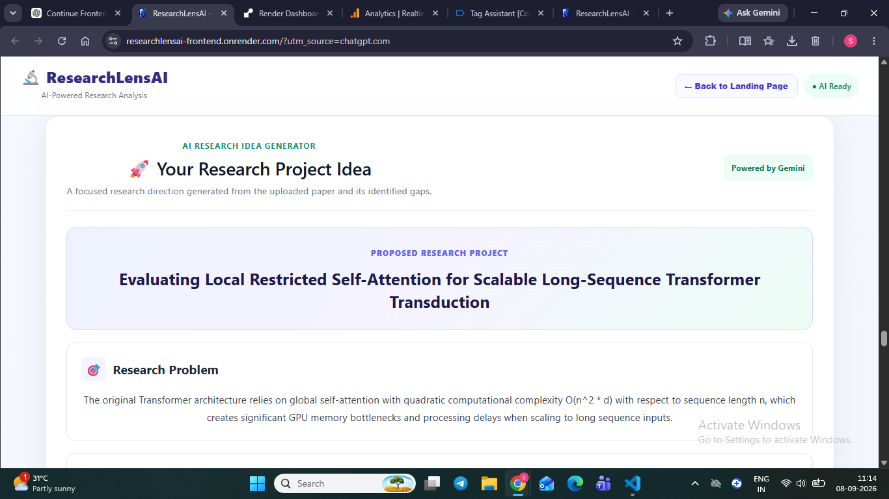
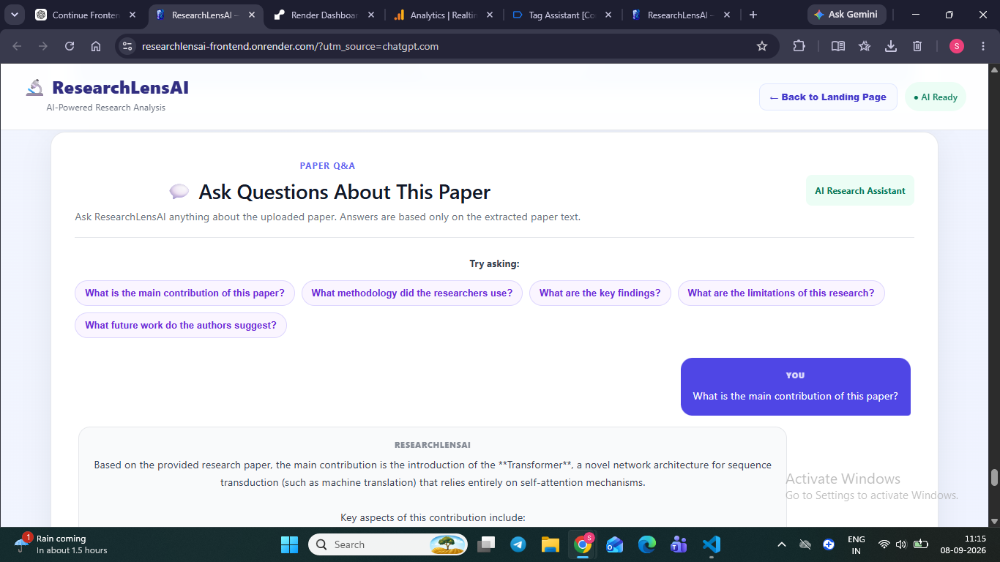
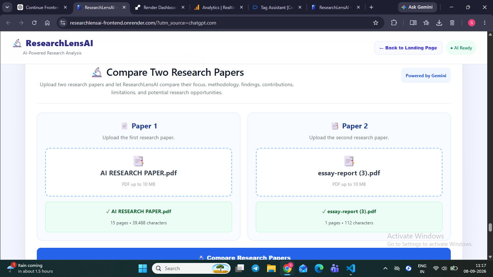
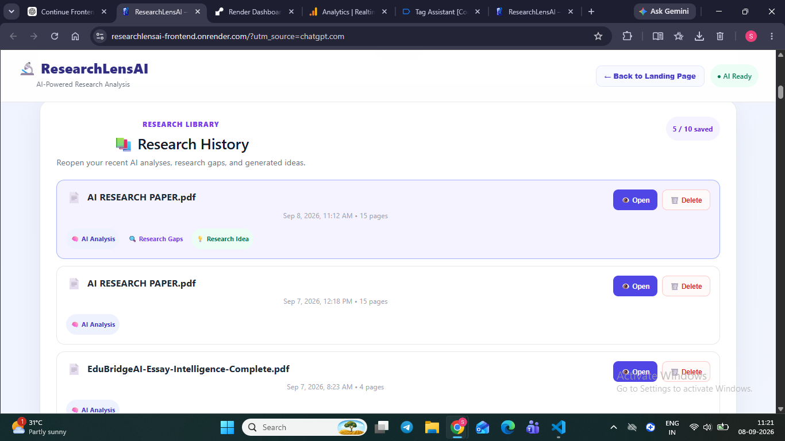

# ResearchLensAI

### AI-Powered Research Paper Analysis & Discovery Platform

ResearchLensAI is an AI-powered research assistant designed to help students, researchers, and academic learners understand research papers more efficiently and discover potential directions for future research.

The platform combines research paper analysis, research gap detection, AI-generated research ideas, paper-based question answering, and research paper comparison into a single workspace.

---

## 🚀 Overview

Reading and understanding academic research papers can be time-consuming, especially when trying to identify:

- The main objective of a study
- Research methodology
- Key findings
- Contributions
- Limitations
- Existing research gaps
- Possible directions for future research

ResearchLensAI uses AI to organize these elements into structured, readable results.

Users can upload a research paper in PDF format and use multiple AI-powered tools to explore the paper and generate new research directions.

---

## ✨ Features

### 📄 AI Paper Analysis

Upload a research paper in PDF format and receive a structured analysis covering:

- Research objective
- Methodology
- Key findings
- Contributions
- Limitations
- Future research directions

---

### 🔎 Research Gap Detection

ResearchLensAI analyzes the uploaded paper to identify potential research gaps and unexplored areas that could provide opportunities for future studies.

---

### 💡 Research Idea Generator

Generate a potential research project based on the uploaded paper and detected research gaps.

The generated research direction can include:

- Research title
- Research problem
- Research objective
- Research question
- Hypothesis
- Proposed methodology
- Dataset requirements
- Techniques and models
- Evaluation metrics
- Expected contribution
- Novelty explanation
- Feasibility
- Suggested next steps

---

### 💬 Ask Your Paper

Users can ask questions about an uploaded research paper.

The AI uses the extracted paper content to answer questions and keeps the interaction focused on the provided research material.

---

### ⚖️ Research Paper Comparison

Upload two research papers and compare them across multiple dimensions, including:

- Research focus
- Similarities
- Differences
- Methodology
- Findings
- Contributions
- Limitations
- Research direction

The tool also identifies opportunities for combining ideas from both papers.

---

### 📊 Research Dashboard

The Research Dashboard provides an overview of research activity, including:

- Papers analyzed
- Research gaps detected
- Research ideas generated
- Paper comparisons
- Questions asked

ResearchLensAI also maintains recent activity and saved research history in the browser.

---

### 📚 Research History

Previously analyzed papers can be saved locally in the browser.

Users can revisit saved analyses, including:

- Paper information
- AI analysis
- Detected research gaps
- Generated research ideas

---

## 🛠️ Technology Stack

### Frontend

- React
- Vite
- JavaScript
- Axios
- HTML
- CSS

### Backend

- Node.js
- Express
- Multer
- pdf-parse
- CORS
- express-rate-limit

### AI

- Google Gemini API
- `@google/genai`

### Development & Deployment

- Git
- GitHub
- Render

---

## 🏗️ Architecture

ResearchLensAI follows a client-server architecture.

```text
                    ┌──────────────────────┐
                    │      User / Web      │
                    └──────────┬───────────┘
                               │
                               ▼
                    ┌──────────────────────┐
                    │   React Frontend     │
                    │       + Vite         │
                    └──────────┬───────────┘
                               │
                         HTTP / Axios
                               │
                               ▼
                    ┌──────────────────────┐
                    │   Node.js / Express  │
                    │       Backend        │
                    └──────────┬───────────┘
                               │
              ┌────────────────┼────────────────┐
              │                │                │
              ▼                ▼                ▼
       PDF Extraction      AI Processing     Validation &
        pdf-parse          Gemini API        Rate Limiting
              │                │
              └────────────────┘
                       │
                       ▼
                Structured Results

## Screenshots

### Landing Page


### PDF Upload


### AI Paper Analysis


### Research Gap Detection


### AI Research Idea Generator


### Paper Q&A


### Paper Comparison


### Research History & Dashboard

